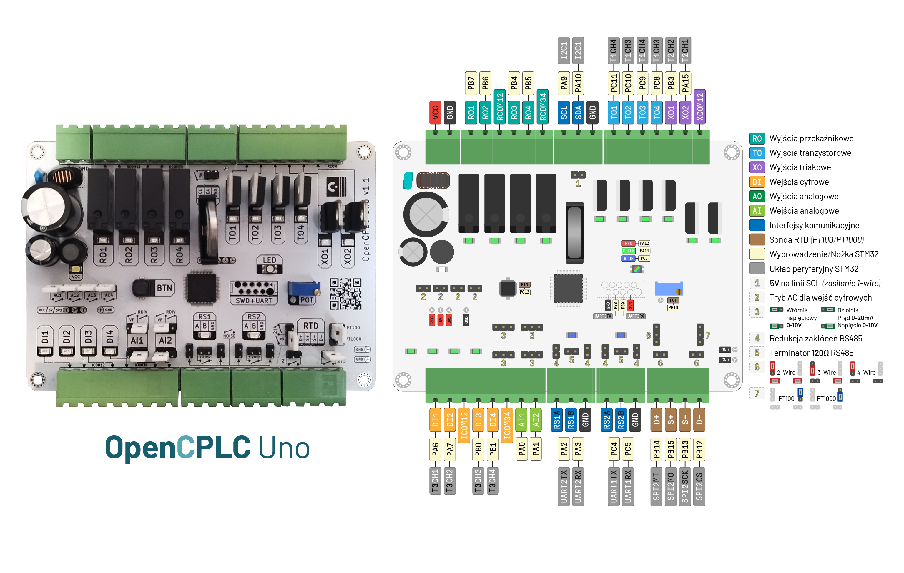

## Ewolucja programowalnych płytek jako odpowiedź na zmiany rynkowe i rozwój paradygmatu technologicznego

#### Streszczenie

Artykuł analizuje ewolucję programowalnych płytek w kontekście dynamicznych zmian rynkowych, technologicznych i nowych podejść do projektowania systemów wbudowanych. Przedstawiono historię rozwoju płytek ewaluacyjnych oraz ich wpływ na inżynierię, podkreślając przejście od zamkniętych ekosystemów do otwartych standardów. Szczególną uwagę poświęcono roli otwartego oprogramowania oraz modularnych architektur w kształtowaniu nowoczesnych rozwiązań. Na przykładzie projektu **OpenCPLC** ukazano, jak warstwowe podejście do projektowania może zwiększyć elastyczność i zakres zastosowań sterowników PLC, zarówno w przemyśle, jak i edukacji. Ewolucja płytek deweloperskich wskazuje na wyraźny trend, gdzie otwartość i modułowość stają się kluczowymi czynnikami determinującymi przyszłość systemów wbudowanych.

**Słowa kluczowe**:  programowalne płytki rozwojowe, mikrokontrolery, sterowniki PLC, otwarte standardy, systemy wbudowane, modularna architektura, OpenCPLC, integracja sprzętowa

### Wstęp

**Płyty programowalne**, znane także jako płytki deweloperskie czy ewaluacyjne, odgrywają istotną rolę w rozwoju systemów wbudowanych od początków mikroelektroniki [^1]. Są nieodzownym narzędziem w procesie projektowania, zwłaszcza na wczesnych etapach prac, a także pełnią funkcję edukacyjną i demonstracyjną. Ich rozwój nie przebiegał w izolacji, lecz był ściśle związany z ewolucją mikrokontrolerów i narzędzi programistycznych umożliwiających ich programowanie. Płyty te były raczej wynikiem postępu technologicznego mikrokontrolerów i dostępnych narzędzi niż samodzielnie rozwijającym się elementem. Całość wpisuje się w kontekst dynamicznie zmieniającej się technologii, rosnących potrzeb inżynierów i wymagań rynkowych. Przyjrzyjmy się, jak te narzędzia ewoluowały na przestrzeni lat. Od wczesnych lat 70. XX wieku aż po współczesność [^2].

Wczesne komputery _(np. **IBM**)_ oraz późniejsze mikrokomputery _(np. **Raspberry Pi**)_, przeznaczone do pracy z systemami operacyjnymi, oraz ukłafy **FPGA**, także mogą być uznawane za płyty ewaluacyjne i niewątpliwie stanowią część systemów wbudowanych. W niniejszym artykule pominięto jednak ten temat, aby skupić się wyłącznie na mikrokontrolerach.

[^1]: L. Gomes, **Programmable logic devices supporting embedded system design curriculum**, IEEE Micro, 2006, DOI:  10.1109/IECON.2005.1569241
[^2]: K. Raghu Raghunathan, **History of Microcontrollers: First 50 Years**, IEEE Micro, 2021, `10.1109/MM.2021.3114754`

### Narodziny Mikroprocesorów

Początek lat 70. to okres, w którym zaczęto rozwijać mikroprocesory. Jako pierwszy pojawił się 4-bitowy **Intel 4004** (rys. 1a, rys. 2a), który był jednostką arytmetyczno-logiczną _(ALU)_, wymagającym podłączenia dodatkowych układów zewnętrznych, takich jak kontrolery I/O, pamięci RAM i ROM. Programowanie odbywało się przez zapisywanie programu w pamięci ROM, która była trwale programowana w procesie produkcyjnym, a schematy logiki często były projektowane przy użyciu kart perforowanych.

W kolejnych latach na rynku zaczęły pojawiać się bardziej zintegrowane układy, które można już było określić mianem mikrokontrolerów, gdyż zawierały pamięći **RAM** i **ROM**, eliminując konieczność stosowania zewnętrznych modułów. Przykładami takich układów są **TMS 1000** od Texas Instruments oraz 8-bitowy **Intel 8048** _(rys. 1b, rys. 2b)_, wyposażony dodatkowo w **timer** sprzętowy. Układy programowane były w **asemblerze**, z wykorzystaniem prostych terminali. Zastosowanie pamięci **EEPROM** pozwoliło na wielokrotne programowanie bez wymiany układu, ułatwiając szybkie modyfikacje kodu.

> **Rysunek 1.** (a) Mikroprocesor Intel 4004; (b) Mikrokontroler 8048

> **Rysunek 2.** Płyty rozwojowe: (a) Rodzina MCS-4, w tym Intel 4004; (b) iSBC-80/10 z mikrokontrolerem 8048  

W tamtych czasach płyty rozwojowe _(deweloperskie)_ nie były postrzegane jako narzędzia do nauki czy eksperymentowania, ale jako kluczowe narzędzia mające na celu usprawnienie realizacji konkretnych projektów inżynieryjnych, a ich funkcjonalność była zbliżona do samego mikrokontrolera.

### Narodziny Mikroprocesorów

Początek lat 70. to okres, w którym zaczęto rozwijać mikroprocesory. Jako pierwszy pojawił się 4-bitowy **Intel 4004** (rys. 1a, rys. 2a) [^3], który był jednostką arytmetyczno-logiczną _(ALU)_, wymagającym podłączenia dodatkowych układów zewnętrznych, takich jak kontrolery I/O, pamięci RAM i ROM. Programowanie odbywało się przez zapisywanie programu w pamięci ROM, która była trwale programowana w procesie produkcyjnym, a schematy logiki często były projektowane przy użyciu kart perforowanych.

W kolejnych latach na rynku zaczęły pojawiać się bardziej zintegrowane układy, które można już było określić mianem mikrokontrolerów, gdyż zawierały zarówno pamięć **RAM**, jak i **ROM**, eliminując konieczność stosowania zewnętrznych modułów. Przykładami takich układów są **TMS 1000** od Texas Instruments oraz 8-bitowy **Intel 8048** _(rys. 1b, rys. 2b)_, wyposażony dodatkowo w **timer** sprzętowy. Układy programowane były w **asemblerze**, z wykorzystaniem prostych terminali. Zastosowanie pamięci **EEPROM** pozwoliło na wielokrotne programowanie bez wymiany układu, ułatwiając szybkie modyfikacje kodu.

W tamtych czasach płyty rozwojowe _(deweloperskie)_ nie były postrzegane jako narzędzia do nauki czy eksperymentowania, ale jako kluczowe narzędzia mające na celu usprawnienie realizacji konkretnych projektów inżynieryjnych, a ich funkcjonalność była zbliżona do samego mikrokontrolera.

[^3]: F. Faggin, M. Hoff, S. Mazor, M. Shima, **The history of the 4004**, IEEE Micro, 1996, `DOI:  10.1109/40.546561`

### Wczesny rozwój techniki mikroprocesorowej

Szybko dostrzeżono, że nadchodzi technologiczna rewolucja, a technologie oparte na mikrokontrolerach, rozwijane od lat 70., mają znaczący potencjał rozwoju i ulepszeń. Pojawiła się zatem potrzeba zaprezentowania ich funkcjonalności szerszemu gronu odbiorców. W odpowiedzi na to płyty deweloperskie zaczęły być projektowane jako bardziej przemyślane i kompleksowe produkty, przeznaczone dla inżynierów elektroniki z różnych sektorów.

Przełomowa konstrukcja prototypowa, **SDK-85** [^4] z mikroprocesorem **Intel 8085** _(rys. 3)_, zapewniała kompleksowe środowisko testowe. Umożliwiała programowanie w asemblerze zarówno przez zewnętrzny terminal podłączany przez interfejs pętli prądowej **20mA**, jak i za pomocą wbudowanej **klawiatury** oraz **wyświetlacza**. Było to szczególnie istotne w czasach, kiedy poziom komputeryzacji był jeszcze niski, a taka opcja okazywała się bardziej ergonomiczna dla większości inżynierów. Ponadto, klawiaturę i wyświetlacz można było wykorzystać bezpośrednio z poziomu aplikacji. Płyta rozwojowa SDK-85 jest wyposażona również w:

- Zegar systemowy **3MHz**
- Pamięć RAM **256B**/512B
- Pamięć EPROM **2kB**/4kB
- Timer **14-bit**owy programowalny
- **22** linie **I/O** (+16 I/O z rozszrzeniem)

> **Rysunek 3.** Płyta rozwojowa SDK-85 z mikroprocesorem 8085

W ślad za Intelem inni producenci również wprowadzili własne płyty deweloperskie, m.in.:

- Zilog ZDS Z80
- Motorola M68HC11 Evaluation Board
- National Semiconductor SC/MP II
- Texas Instruments TMS 9900
- MOS Technology KIM-1

Jednak żadna z nich nie osiągnęła tak dużego sukcesu jak SDK-85, głównie z powodu późniejszego wejścia na rynek. Intel zaprezentował SDK-85 już w 1976 roku, a w 1980 roku udoskonaloną wersję **SDK-86**, wspierającą systemy operacyjne. Konkurencyjne rozwiązania pojawiły się później, co znacząco ograniczyło ich rynkową przewagę.

[^4]: J. C. Rieth, **A Microprocessor Managed Shipboard Tank Level Indicator System**, Naval Postgraduate School, 1980, `DOI:  10.1109/40.546561`

### Początki język C oraz IDE

W latach 80. pojawiły się pierwsze mikrokontrolery obsługujące język C, co znacząco ułatwiło rozwój oprogramowania w systemach wbudowanych. Jednym z pionierów był **Intel 8051**, który w połączeniu z płytą rozwojową **EVK-51** zyskał popularność dzięki ekosystemowi **Keil C51**[^5]. Pakiet ten integrował kluczowe narzędzia, w tym kompilator, debuger oraz programatory, takie jak Willem EPROM Programmer, umożliwiające zapis wsadu do pamięci mikrokontrolera metodą **ISP** _(In-System Programming)_, a w późniejszych wersjach także przez **UART _(RS-232)_**.

Jednak pod koniec lat 90., dzięki szerszemu wsparciu dla różnych architektur, coraz większą popularność zdobywał **IAR Embedded Workbench**[^6] (rys. 7). Narzędzie to, choć bazowało na podobnych założeniach, spełniało więcej norm, co sprawiło, że stało się preferowanym wyborem w aplikacjach przemysłowych, medycznych i motoryzacyjnych Później **Keil** odświeżył i rozbudował swoje **IDE** _(integrated development environment)_, które w kolejnych latach przyjęło nazwę **µVision** _(rys. 7)_, umacniając swoją pozycję, szczególnie w systemach opartych na mikrokontrolerach **ARM**.

Pierwsi inżynierowie systemów wbudowanych oczekiwali narzędzi umożliwiających szybkie i wygodne tworzenie oprogramowania bez konieczności ręcznej konfiguracji licznych, odrębnych komponentów. Pierwsze IDE wyróżniały się pełną integracją, wysoką stabilnością oraz wsparciem technicznym, co przyczyniło się do ich dominacji na rynku.

Wprowadzenie **języka C** do systemów wbudowanych znacząco ułatwiło rozwój oprogramowania, zapewniając zarówno niskopoziomową kontrolę nad sprzętem, jak i przenośność kodu między różnymi architekturami [^7]. Dzięki swojej efektywności, elastyczności oraz ugruntowanej pozycji jako pierwszego szeroko stosowanego języka w tej dziedzinie, C pozostaje dominującym standardem w programowaniu mikrokontrolerów.

[^5]: M. Beach, C. Hills, **C51 Primer**, Springer, 1996, `ISBN: 9783642047985, 364204798X`
[^6]: M.A. Koslowski, G.B. Borba, **An Easy-to-Use Development Kit for a Microcontroller Course Based on the 8051**, Intertech Conference Proceedings, 2014, `DOI: 10.14684/intertech.13.2014.100-104` 
[^7]: TW Schultz, T Schultz, **C and the 8051**, Springer, 2003, `ISBN: 9783540204091, 3540204091`

### Dalszy rozwój mikrokontrolerów

W połowie lat 80. wyraźnie ukształtował się podział między mikroprocesorami **CPU** a mikrokontrolerami **MPU**. Mikroprocesory rozwijano z myślą o komputerach osobistych i systemach operacyjnych, podczas gdy mikrokontrolery integrowały w jednym układzie scalonym coraz więcej peryferiów, takich jak przetworniki **ADC** i **DAC**, komparatory, interfejsy **SPI**, **UART** i **I²C**, a także zaawansowane układy taktowania z pętlą **PLL** (_tab. 1_). Obecnie wiele z tych funkcji stało się standardem i jest integrowanych w większości konstrukcji **MPU** ogólnego przeznaczenia, eliminując potrzebę stosowania wielu zewnętrznych komponentów, także na płytach demonstracyjnych.

Do pracy z "pełnoprawnymi" mikrokontrolerami przeznaczone były m.in. płyty z serii **PICDEM**[^8] _(rys. 4a)_ od Microchip oraz **STK500**[^9] _(rys. 4b)_ dla układów **AVR** firmy Atmel . Skierowane głównie do profesjonalistów oraz studentów uczelni technicznych zajmujących się systemami wbudowanymi, oferowały szeroki zestaw interfejsów, złącz oraz elementów testowych, takich jak diody LED, przyciski, potencjometry, buzzery, wyświetlacze oraz obszar do prototypowania, co umożliwiało szybkie wdrażanie i testowanie nowych rozwiązań. Dzięki zastosowaniu podstawek pozwalały na pracę z różnymi modelami mikrokontrolerów, zapewniając elastyczność w doborze układów. Płyty te stanowiły reprezentatywny przykład rozwiązań swojej epoki, odgrywając istotną rolę w edukacji oraz profesjonalnym rozwoju systemów wbudowanych.

> **Rysunek 4.** Płyty rozwojowe (a) Microchip PICDEM 2 (b) Atmel STK500

Wykorzystywały dedykowane interfejsy programowania **ICSP** _(Microchip)_, **ISP** _(Atmel)_ oraz **JTAG**, który jako pierwszy stał się otwartym standardem do programowania i debugowania. Szybko zyskał popularność, a większość współczesnych procesorów i mikrokontrolerów jest w niego wyposażona.

Wraz z pojawieniem się pierwszych zaawansowanych edytorów o modułowej architekturze _(umożliwiających integrację własnych rozwiązań)_, producenci mikrokontrolerów tamtego okresu postanowili je wykorzystać. Microchip dostosował **NetBeans**, tworząc **MPLAB**, natomiast Atmel oparł swoje środowisko na **Visual Studio**, rozwijając **AVR Studio** _(rys. X)_, które później ewoluowało w Atmel Studio. Pomimo dużego wsparcia nigdy nie osiągnęły takiej popularności jak wcześniejsze i późniejsze rozwiązania.

Choć mikrokontrolery **AVR** oraz **PIC** idealnie odpowiadały na potrzeby rynku, szybko dostrzeżono, że bardziej efektywnym podejściem jest rozdzielenie rozwoju rdzenia, licencjonowanego przez **ARM**, od projektowania układów peryferyjnych przez producentów mikrokontrolerów. Model ten przyczynił się do rosnącej dominacji procesorów **ARM** pod koniec XX wieku, gdy mikrokontrolery zyskiwały coraz większe znaczenie w przemyśle. Pierwsze układy oparte na architekturze **ARM7** łączyły wysoką wydajność z energooszczędnością. Wśród pionierów znalazły się **LPC2000** od Philipsa _(obecnie NXP)_ z płytą **LPC-P2148**[^10] _(rys. 5)_ od Olimex oraz seria **STR7** od STMicroelectronics, które zapoczątkowały erę **32-bit**owych mikrokontrolerów.

> **Rysunek 5.** Płyta rozwojowa LPC-P2148 z mikroprocesorem LPC2000

[^8]: M. P. Bates, **Programming 8-bit PIC Microcontrollers in C: with Interactive Hardware Simulation**, Newnes, 2008, `ISBN: 9780080560144, 0080560148`
[^9]: D.P. Upadyshev; O.P. Razumeiko, **Disk for studying microcontrollers**, IEEE Micro, `DOI: 10.1109/SPCMTT.2008.4897492`
[^10]: A. Kommu, R. Rao, **Designing a learning platform for the implementation of serial standards using ARM microcontroller LPC2148**, IEEE Micro, 2014, `DOI: 10.1109/ICRAIE.2014.6909185`

### Minimalizm i otwarte standardy

Na początku XXI wieku, wraz z pojawieniem się platformy **Arduino** _(rys. 6a)_, zmieniło się podejście do projektowania płyt ewaluacyjnych[^11]. Nowa koncepcja zakładała minimalizację kosztów poprzez ograniczenie liczby komponentów na płytach rozwojowych, co zwiększyło ich dostępność dla szerokiego grona użytkowników, dzięki redukcji bariery wejścia poprzez dedykowane IDE, wsparcie jedynie wybranych mikrokontrolerów, a także wysokiej jakości dokumentacji i materiałów dodatkowych. Efektem tego był rozwój aktywnej społeczności, której zaangażowanie w tworzenie nowych rozwiązań dodatkowo napędzało dalszy rozwój platformy.

Standardowa konstrukcja tych płytek obejmowała jedynie niezbędne elementy, takie jak mikroprocesor z bootloaderem _(umożliwiający programowanie bez zewnętrznego programatora)_, stabilizator napięcia, rezonator kwarcowy oraz listwy kołkowe _(goldpiny)_ do podłączania układów peryferyjnych.

Z czasem producenci modułów rozwojowych zaczęli dostosowywać wyprowadzenia płytek testowych w taki sposób, aby były kompatybilne z tym standardowym rozstawem złączy, co ułatwiło ich integrację i stało się powszechną praktyką dzięki zastosowaniu licencji **open-hardware** (CC BY-SA)[^12]. Takie rozwiązanie zredukowało koszty, trafiając do jeszcze szerszego grona odbiorców. Śladem Arduino podążył Microchip, wprowadzając otwarty standard **microBUS**, który mimo bardziej dopracowanego projektu nie osiągnął tak dużej popularności.

Od tego momentu większość modułów i płyt testowych zaczęła być udostępniana jako otwarte projekty. Choć oferowały jedynie podstawową funkcjonalność, towarzyszyła im pełna dokumentacja techniczna, co znacznie ułatwiało ich integrację w bardziej złożonych systemach. Dzięki temu inżynierowie systemów wbudowanych mogą dobrać odpowiednie moduły i rozpocząć prace deweloperskie jeszcze przed zaprojektowaniem płytki PCB. Dodatkowym ułatwieniem są udostępniane na licencji **open-source** biblioteki demonstracyjne, które przyspieszają proces wdrożenia.

Obecnie najpopularniejszą platformą deweloperską jest **Nucleo** _(rys. 6b)_[^13], co jest bezpośrednio powiązane z sukcesem mikrokontrolerów **STM32**. Istotną rolę odgrywa niska cena płytki, oscylująca w okolicach 45-85zł, która na dodatek zawiera programator/debugger **ST-Link**. Wśród innych popularnych platform znajdują się **FRDM** _(NXP)_ oraz **LaunchPad** od _(Texas Instruments)_. Jednak kluczowym elementem decydującym o popularności danego rozwiązania jest jego _"ekosystem"_. Oprócz wysokiej jakości dokumentacji, użytkownicy oczekują dostępności bibliotek, przykładów demonstracyjnych zarówno dla firmware, jak i software, oraz zapewnienia długoterminowego wsparcia. Rozwój tego ekosystemu nie musi zależeć wyłącznie od producentów mikrokontrolerów. Firmy produkujące moduły, takie jak Waveshare, Adafruit, oraz społeczności publikujące na forach czy **GitHub**, mogą aktywnie przyczyniać się do jego rozwoju. Z uwagi na zdywersyfikowaną naturę tego "ekosystemu", otwartość publikowanych produktów staje się kluczowym czynnikiem jego sukcesu. Płyty deweloperskie stanowią ważną część tego ekosystemu, a ich sukces jest ściśle skorelowany z jego kondycją na rynku.

> **Rysunek 6.** Płyty rozwojowe (a) Arduino Uno (b) Nucleo STM32G0RB

Na początku XXI wieku podejście do IDE zaczęło się zmieniać. Coraz więcej inżynierów dostrzegało zależności między kompilatorem, debugerem, programatorem i językiem programowania, co uwidoczniło ograniczenia silnie zintegrowanych środowisk. Ich zamknięta architektura często utrudniała elastyczne dostosowanie do specyficznych wymagań projektowych. Odpowiedzią stał się modułowy i otwarty **Eclipse**, wspierany przez IBM, który dzięki systemowi wtyczek umożliwiał swobodne rozszerzanie funkcjonalności.

Co ciekawe, STMicroelectronics w tamtym czasie nie posiadało własnego IDE. Potrzeba była tak duża, że właśnie na bazie Eclipse oddolnie rozwinął się projekt **Atollic** TrueSTUDIO, który z czasem został wchłonięty i rozbudowany, tworząc oficjalne **STM32CubeIDE** _(rys. 7)_. To doskonały przykład siły społeczności internetowej. Z podobnego rozwiązania skorzystało również NXP, rozwijając MCUXpresso na bazie Eclipse.

Coraz większą popularność zdobywa **VSCode** _(Visual Studio Code)_ [^14], wyróżniający się szybkością działania, intuicyjnością i otwartą architekturą. Jego lekka struktura zużywa mniej zasobów niż tradycyjne IDE, a rozbudowany ekosystem rozszerzeń umożliwia łatwą integrację z narzędziami do programowania systemów wbudowanych. Obecnie Arduino zrezygnowało z dalszego rozwoju własnego IDE, adaptując VSCode do swoich potrzeb, a **PlatformIO** również rozwija się dynamicznie _(rys. 7)_.

> **Rysunek 7.** Ewolucja IDE uwzględniając ich względną popularność

A Systematic Literature Review Exploring the Barriers and Challenges to Open Innovation within the Financial Service Industry

[^11]: T. Nguyen, S. Zoëga Andreasen, A. Wolff, D. Duong Bang, **Open-Source Mikrosterowniki w Urządzeniach Lab-on-a-Chip, Micromachines**, 2018, `ISSN: 2072-666X`
[^12]: A. Kalache, H. Lunnikivi, D. Timo, **Open-Source RISC-V Microcontroller for Rust-Based Hard Real-Time Systems, Tampere University**, 2024, `ISBN 9783031661464`
[^13]: J. McLurkin, J. Rykowski, M. John, Q. Kaseman, A. J. Lynch, **Using Multi-Robot Systems for Engineering Education: Teaching and Outreach With Large Numbers of an Advanced, Low-Cost Robot**, IEEE, 2013, DOI: `10.1109/TE.2012.2222646`
[^14]: A. Eliasz, **Zephyr RTOS Embedded C Programming**, Apress, 2024, `DOI: 10.1007/979-8-8688-0107-5`, `ISBN: 9798868801075`

### Układy SoC

Gdy dana funkcjonalność zaczęła pojawiać się coraz częściej, zwłaszcza w przypadku interfejsów i protokołów komunikacyjnych, takich jak **USB**, **CAN** czy **Ethernet** _(tab. 1)_, integrowano ją jako kolejny układ peryferyjny, rozszerzający możliwości mikrokontrolera. Jednak gdy układy stawały się zbyt rozbudowane i skomplikowane, jak w przypadku **Bluetooth**, **Wi-Fi** czy **LoRa** _(tab. 1)_, naturalną konsekwencją było zamknięcie kilku modułów w jednym układzie scalonym, ale z luźniejszą integracją. Nie odbywało się to już za pomocą rejestrów, jak w przypadku klasycznych peryferiów, lecz poprzez magistrale _(np. wewnętrzne SPI)_ lub osobne rdzenie z dedykowanym firmware. W efekcie wcześniej zewnętrzne układy stały się częścią układu programowalnego, co określamy mianem **SoC _(System on Chip)_**.

W przypadku płytek deweloperskich z tego typu układami konieczne jest wyposażenie ich w odpowiednie komponenty umożliwiające pełne wykorzystanie dostępnych funkcji. Obejmuje to między innymi układy toru radiowego w systemach bezprzewodowych oraz transceivery dostosowujące poziomy sygnałów i sposób transmisji do wymagań przewodowych standardów komunikacyjnych.

Najpopularniejszym SoC jest **ESP32**[^15] _(rys. 8a)_, które zdobyło uznanie dzięki niskiej cenie i łatwości implementacji. Zawiera zintegrowane moduły Wi-Fi i Bluetooth. W bardziej zaawansowanych zastosowaniach powszechnie stosowane są układy firmy Nordic Semiconductor _(**nRF52**[^16])_ _(rys. 8b)_ oraz STMicroelectronics _(**STM32WB**, **STM32WL**)_. Rozwój tych technologii jest ściśle związany z Internetem Rzeczy _(**IoT**)_ oraz informatyzacją przemysłu _(Przemysł 4.0)_.

> **Rysunek 8.** Płyty rozwojowe (a) ESP32 (b) Nucleo nRF52

[^15]: J. Soto-Cruz, E. Ruiz-Ibarra, J. Vázquez-Castillo, **A Survey of Efficient Lightweight Cryptography for Power-Constrained Microcontrollers**, Technologies, 2024, `DOI: 10.3390/technologies13010003`
[^16]: R. B. Salikhov; V. Kh. Abdrakhmanov; T. T. Yumalin, **Experience of Using Bluetooth Low Energy to Develop a Sensor Data Exchange System Based on the NRF52832 Microcontroller**, IEEE, 2021, `DOI: 10.1109/UralCon52005.2021.9559492`

### Podsumowanie

Dynamiczny rozwój mikrokontrolerów, narzędzi programistycznych oraz płyt ewaluacyjnych ujawnia wyraźny trend. Początkowo dominowały komercyjne, zamknięte rozwiązania, które zdobywały rynek dzięki szybkiemu dopasowaniu do jego potrzeb. Jednak w dłuższej perspektywie okazywały się barierą innowacji, ustępując miejsca technologiom otwartoźródłowym. To właśnie otwarte standardy przetrwały próbę czasu i nadal są rozwijane, podczas gdy wiele zamkniętych ekosystemów zostało porzuconych.

Rozwój płytek ewaluacyjnych pokazał, że minimalizacja kosztów i maksymalne uproszczenie wdrożeń dzięki modułowemu podejściu, zastosowaniu otwartych standardów, solidnej dokumentacji oraz wysokiej jakości bibliotekom i przykładom to kluczowe czynniki zapewniające sukces na rynku.

Projektując nowe rozwiązania, warto opierać się na otwartych standardach oraz tworzyć oprogramowanie i rozwiązania sprzętowe w sposób otwarty i modułowy, z naciskiem na potrzeby odbiorcy, który ma je wdrażać i wykorzystywać. Kluczowe jest, aby proces ten jak najlepiej wspierał użytkownika końcowego. Jest to szczególnie istotne w środowisku akademickim oraz wszędzie tam, gdzie celem jest rozwój technologii, a nie wyłącznie krótkoterminowy zysk.

Nie można jednak całkowicie zaniedbać potrzeb rynku, o czym przypomina sukces SoC, gdzie silna integracja kontrastuje z podejściem modułowym _(warstwowym)_. Integracja ta przyczynia się do miniaturyzacji i obniżenia kosztu końcowego produktu, dlatego będzie postępować, podobnie jak miało to miejsce od początków mikroprocesorów _(rys. 9)_.

> **Rysunek 9.** Chronologiczny układ rozdziałów w pracy

Najważniejsze układy programowalne, wraz z powiązanymi płytkami ewaluacyjnymi oraz wyróżnieniem kolejnych zintegrowanych funkcji _(pogrubione)_ i innych kluczowych cech, zostały zestawione w **tabeli 1**. Rozwój systemów wbudowanych to rezultat działań wielu firm, które, choć często działają niezależnie, wpływają na siebie nawzajem, tworząc jeden dynamicznie ewoluujący ekosystem.

> **Tabela 1.** Przełomowe mikroprocesory, w których nowa funkcjonalność stała się standardem, oraz te, które zyskały dużą popularność _(wraz z płytą rozwojową)_

| Rok  | MPU lub SoC                   | Peryferia i cechy szczególne                    | Devboard                       |
| ---- | ----------------------------- | ----------------------------------------------- | ------------------------------ |
| 1976 | Intel 8048                    | **RAM** + **ROM** + **Timer**                   | Intel MCS-48 Dev Kit           |
| 1976 | Intel 8051                    | Interfejs **UART**                              | Keil MCB51                     |
| 1978 | Texas Instruments TMS770C     | Przetwornik **ADC** _(10-bit)_                  | TMS770C Development Kit        |
| 1979 | National Semiconductor COP420 | Komparator analogowy                            | COP420 Evaluation Kit          |
| 1980 | Motorola 68HC05               | Interfejs **SPI**                               | Motorola 68HC05 EVB            |
| 1982 | Intel 8096                    | Generator **PWM**                               | Intel 8096 Evaluation Board    |
| 1985 | Philips 8051XA                | Interfejs **I²C**                               | Keil MCB51 _(dla 8051)_        |
| 1986 | Atmel AT89C51                 | Kompatybilny z Intel 8051, popularny w edukacji | Atmel AT89C51 Development Kit  |
| 1987 | Motorola MC68HC11             | Pętla **PLL**                                   | Motorola MC68HC11 EVB          |
| 1991 | Motorola MC68HC16             | Przetwornik **DAC**                             | -                              |
| 1992 | Freescale MC68HC05X4          | Interfejs **CAN**                               | -                              |
| 2000 | Philips LPC2000               | _32-bitowy, popularny_                          | LPC2148 Olimex                 |
| 2004 | Microchip PIC18F4550          | Interfejs **USB**                               | PICDEM FS USB _(Microchip)_    |
| 2007 | Microchip PIC18F97J60         | Interfejs **Ethernet**                          | Microchip Ethernet Starter Kit |
| 2008 | Atmel ATmega328P              | _Popularny_                                     | Arduino Uno                    |
| 2012 | Nordic nRF51                  | **Bluetooth**                                   | Nordic nRF51 DK                |
| 2013 | Infineon AURIX TC2xx          | _Sterowanie pojazdami ADAS_                     | AURIX TC2xx Triboard           |
| 2014 | ESP8266 _(Espressif)_         | **Wi-Fi**                                       | ESP8266 NodeMCU                |
| 2016 | ESP32 _(Espressif)_           | 2×Wi-Fi + Bluetooth                             | ESP32 DevKit V1 _(DOIT)_       |
| 2019 | STM32H7                       | _Dostosowany pod **AI**_                        | STM32H7 Nucleo                 |
| 2020 | STM32WLE5                     | **LoRa**                                        | STM32WLE5 Nucleo               |

### Sterowniki PLC

Sterowniki **PLC** _(Programmable Logic Controllers)_ to programowalne urządzenia, które można porównać do mikrokontrolerów, ponieważ posiadają układy peryferyjne I/O oraz interfejsy. Różnią się jednak pod względem standardów i specyfiki zastosowań. Mikrokontrolery są uniwersalne i mogą być wykorzystywane w różnych dziedzinach, podczas gdy sterowniki PLC są dedykowane automatyce przemysłowej i opierają się na mikrokontrolerze jako centralnym elemencie. W tym sensie sterownik PLC stanowi warstwę abstrakcji nad mikrokontrolerem, oferując dodatkowe funkcje wspierające procesy przemysłowe, ale jednocześnie mogąc ograniczać lub uniemożliwiać dostęp do niektórych funkcji mikrokontrolera.

Najpopularniejsze komercyjne sterowniki PLC, takie jak **Siemens S7-1200**, Wago 750-881 czy Allen-Bradley MicroLogix 1400, współpracują z dedykowanym oprogramowaniem umożliwiającym tworzenie i wgrywanie programów. W centrum każdego sterownika znajduje się mikrokontroler odpowiedzialny za obliczenia, sterowanie peryferiami i komunikację. Dedykowane środowiska programistyczne narzucają jednak pewne ograniczenia, pozwalając na korzystanie jedynie z funkcji i bloków dostarczonych przez producenta. Choć ułatwia to tworzenie przejrzystych programów, ogranicza dostęp do niższych warstw, co bywa problematyczne przy zaawansowanych zastosowaniach. Dodatkowo sterowniki danego producenta mogą być programowane wyłącznie w jego środowisku, co prowadzi do większej zależności od dostawcy, ogranicza elastyczność programistów i może negatywnie wpływać na konkurencyjność oraz innowacyjność rynku.

Widać, że paradygmaty technologiczne w przypadku sterowników PLC są zupełnie inne niż w przypadku mikrokontrolerów, SoC i płytek programowalnych. Zamiast otwartości, sprzyjającej innowacyjnemu rozwojowi, priorytetem są niezawodność, długi cykl życia, odporność na warunki przemysłowe oraz bezpieczeństwo. Standardy i certyfikacje zapewniają stabilność i ochronę przed nieautoryzowanym dostępem, a łatwość serwisowania pozwala na modyfikacje programów bez przerywania pracy systemu. Nie oznacza to jednak, że ten trend się nie zmieni. Początkowo wiele rozwiązań opartych na mikrokontrolerach i płytkach rozwojowych miało podobny charakter jak współczesne sterowniki PLC. Świadczy o tym rosnąca popularność otwartych i warstwowych sterowników PLC, w których coraz częściej stosuje się systemy oparte na mikrokomputerach i modułach dostosowanych do standardów automatyki.

Dotychczas jednak żadne w pełni otwarte rozwiązanie, dedykowane prostszym i bardziej niezawodnym procesom i bazujące na bezpośrednim programowaniu mikrokontrolera, nie zdobyło większej popularności. Takie podejście mogłoby zapewnić wyższą stabilność, mniejsze zużycie energii i krótszy czas uruchamiania w porównaniu ze sterownikami opartymi na mikrokomputerach, co czyniłoby je atrakcyjnym wyborem w niektórych zastosowaniach przemysłowych, a z edukacyjnego punktu widzenia takie rozwiązanie pozwala nie tylko na naukę programowania PLC, ale także na zrozumienie działania sprzętu i warstw abstrakcji. Dzięki temu inżynierowie zdobywają praktyczne umiejętności pracy z mikrokontrolerami, optymalizacji kodu i integracji z automatyką. Otwartość platformy sprzyja eksperymentom, rozwija myślenie systemowe i eliminuje ograniczenia typowych zamkniętych środowisk.

### OpenCPLC

Lukę na rynku może wypełnić projekt **OpenCPLC** _(https://github.com/OpenCPLC)_, który, mimo wczesnej fazy rozwoju, jest tworzony zgodnie z duchem otwartego oprogramowania. Wykorzystuje sprawdzone technologie, takie jak **język C**, środowisko VSCode wraz popularnymi wtyczkami, kompilator ARM GCC, OpenOCD do programowania i debugowania oraz system **VRTS** do obsługi wielowątkowości. Zamiast zamkniętych środowisk wprowadza warstwy abstrakcji zgodne ze standardami automatyki, zarówno w postaci bibliotek HAL, jak i dedykowanej konstrukcji sprzętowej. Oferuje aplikację **`wizard.exe`**, która przygotowuje niezbędne narzędzia do pracy oraz umożliwia pracę z workspace, poprzez płynne przełączanie się między projektami.

Konstrukcja OpenCPLC Uno _(rys. 10)_ to pełnoprawny, niskobudżetowy sterownik PLC oparty na mikrokontrolerze STM32. Obsługuje napięcia 12V, 24V oraz 230VAC na wejściach cyfrowych **DI**, co pozwala na zastosowanie w maszynach przemysłowych, automatyce i systemach domowych. Jest wyposażony w przekaźniki **RO**, tranzystory **TO**, triaki oraz **RS485**, wspierając protokoły **Modbus RTU** i **BACnet**. Otwarta architektura i zgodność z popularnymi narzędziami programistycznymi eliminują ograniczenia zamkniętych systemów. Dzięki temu sterownik sprawdza się również jako platforma edukacyjna, pełniąc rolę płytki testowej i demonstracyjnej w laboratoriach.

> **Rysunek 10.** Sterownik OpenCPLC Uno

### Wnioski końcowe

Ewolucja płyt ewaluacyjnych odzwierciedla dynamiczny rozwój technologii i zmieniające się potrzeby rynkowe. Od lat 70., kiedy płyty deweloperskie były projektowane głównie na potrzeby przemysłu, po lata 80. i 90., gdy kluczowe stało się prezentowanie możliwości układów na szerszą skalę, czego efektem było bogactwo i różnorodność układów peryferyjnych i demonstracyjnych. Od przełomu wieku XX mikrokontrolery stały się nieodłącznym, a w przemyśle nawet kluczowym elementem mikroelektroniki. W każdej epoce układy programowalne i ich ekosystemy dostosowywały się do bieżących potrzeb rynkowych.

Brak większych zmian koncepcyjnych w ostatnich latach może świadczyć o dojrzałości rynku i braku potrzeby zmian. Projekt OpenCPLC odbiega od głównego nurtu, zarówno w porównaniu z płytami rozwojowymi, jak i sterownikami PLC. Pod kątem przeznaczenia nie różni się od sterowników PLC, jednak z punktu widzenia paradygmatu technologicznego jest znacznie bardziej podobny do płyty deweloperskiej.

To połączenie, oferujące zarówno teoretyczną naukę, jak i praktyczne zastosowania w rzeczywistych warunkach automatyki, jest kluczowe dla przygotowania przyszłych inżynierów do zawodowych wyzwań w dynamicznie rozwijającym się przemyśle. Niezależnie od kierunku ewolucji technologicznej, płyty ewaluacyjne pozostają niezbędnym narzędziem w inżynierii elektronicznej, odgrywając fundamentalną rolę w procesie tworzenia nowoczesnych urządzeń elektronicznych.
